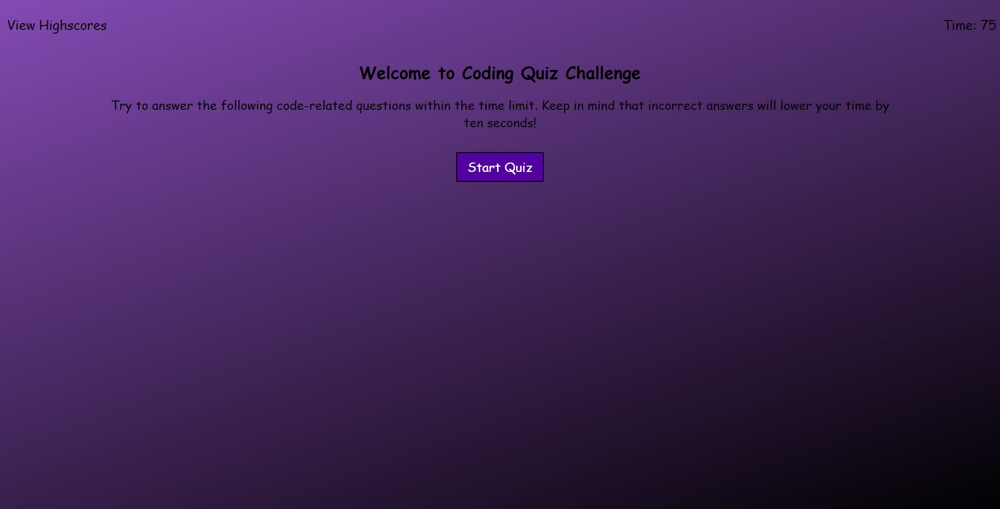
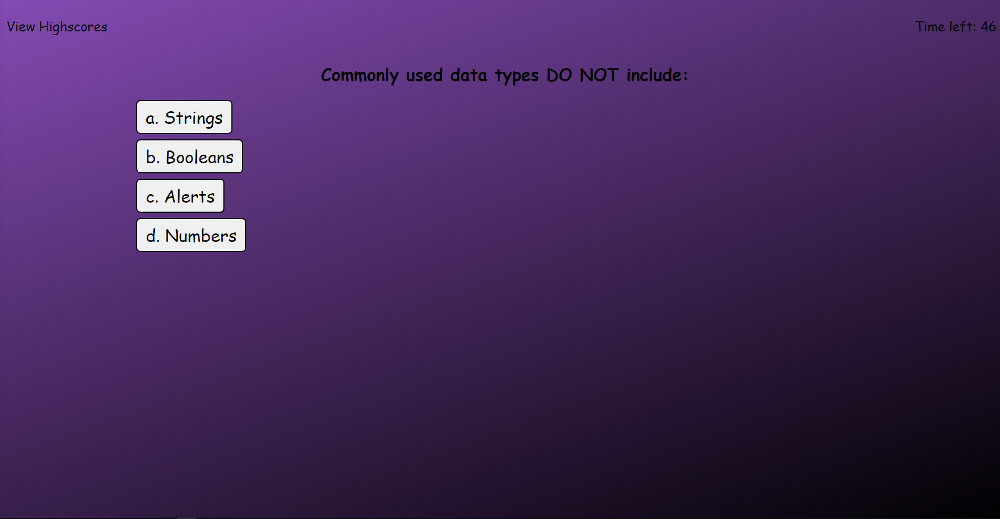
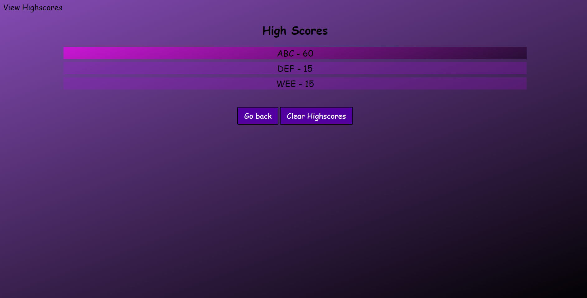

# Coding Quiz

## Description
 - Simple coding assessment/quiz that holds a high-score list after completion inside of local storage.
 - The goal was to implement new JavaScript methods and ideas that I have learned into a browser based quiz.

# Screenshots

## Link to Site
- https://brughk.github.io/Coding-Quiz/

## Usage
N/A